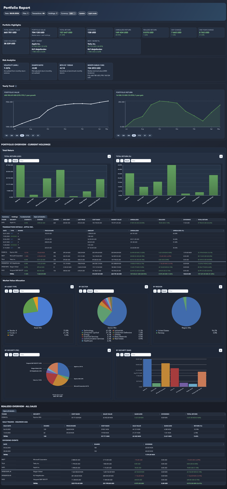

# Portfolio Reporting Platform

Portfolio Reporting Platform is a program that reads investment transactions and generates a browser-based portfolio report. It gives you a consolidated view of current holdings, realized and unrealized return, dividends, detailed sale-trade history across both stocks and funds, and visual charts for total return and market value allocation.

Request access to the web app by email. 

[Web app](https://indsetsportfolioreport.web.app)

## The web app includes:
- Email/password login
- Upload and manage transaction files per user
- Select portfolio and report type (Portfolio report or Annual report)
- Send report requests to the report API and render results in the browser
- Store uploaded files and generated reports for each user

You can also run the program locally on your own machine without the web features.

## What The Java Program Does
- Reads CSV exports from one or more brokers/banks
- Supports comma, semicolon, and tab-separated formats
- Tracks buys, sells, dividends, and current holdings
- Calculates realized and unrealized return (FIFO)
- Resolves ticker and metadata for better report labeling
- Generates a complete HTML report with tables and charts

## Quick Start
1. Export transaction history to CSV.
2. Put files in `transaction_files/` (files with `example` in the filename are ignored).
3. Compile and run:

```bash
javac -d out src/*.java src/*/*.java
java -cp out PortfolioReportGenerator
```

The program generates `portfolio-report.html`.

## Example Data
- `transaction_files/transactions_example.csv` contains realistic sample transactions with both gains and losses.

## Portfolio Example

